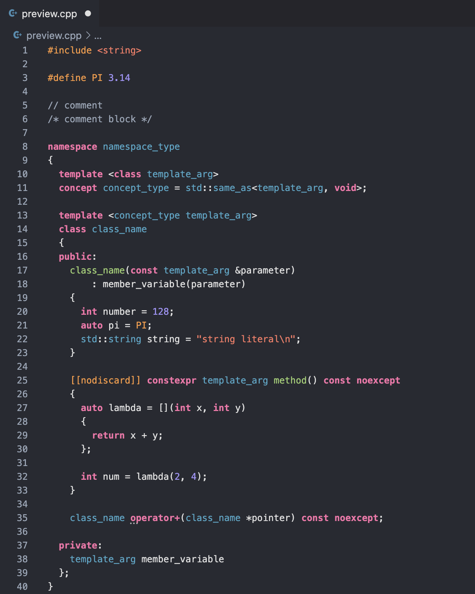

# Mangos Theme 

### Simple Theme for C++, Java, and Python 

### Colours Have Meaning
- `#4eb0cb` Blue: types
- `#a6d67f` Green: functions
- `#a3b0bf` Grey: comments
- `#fe8170` red: strings
- `#a89df7` purple: numbers
- `#ffa150` orange: macros, decorators, annotations 
- `#fe7bb2` pink: keywords
- `#e3e3e3` white: variables, punctuation, plain-text

### C++ Preview

### Java Preview

### Python Preview
