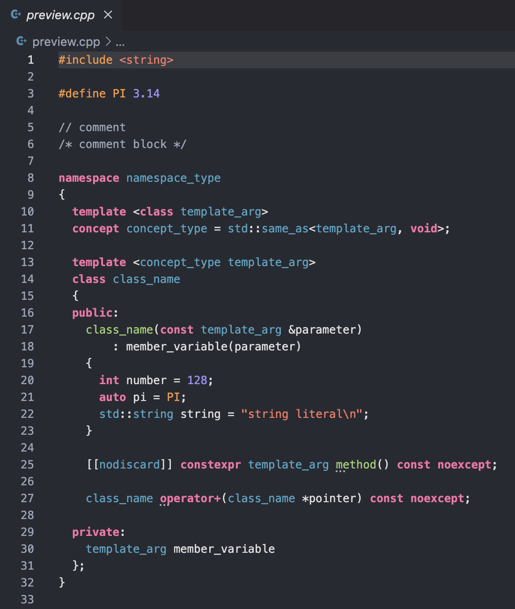

# Mangos Theme 

### Simple Theme for C++, C and Python

An Xcode-inspired theme designed for C++ and Python. 

### Colour Have Meaning
- `#4eb0cb` Blue: classes, structs, namespaces, concepts, etc.
- `#a6d67f` Green: functions and methods
- `#a3b0bf` Grey: comments
- `#fe8170` red: string literals
- `#a89df7` purple: numbers
- `#ffa150` orange: preprocessor macros
- `#fe7bb2` pink: language keywords
- `#e3e3e3` while: other

### C++ Preview

