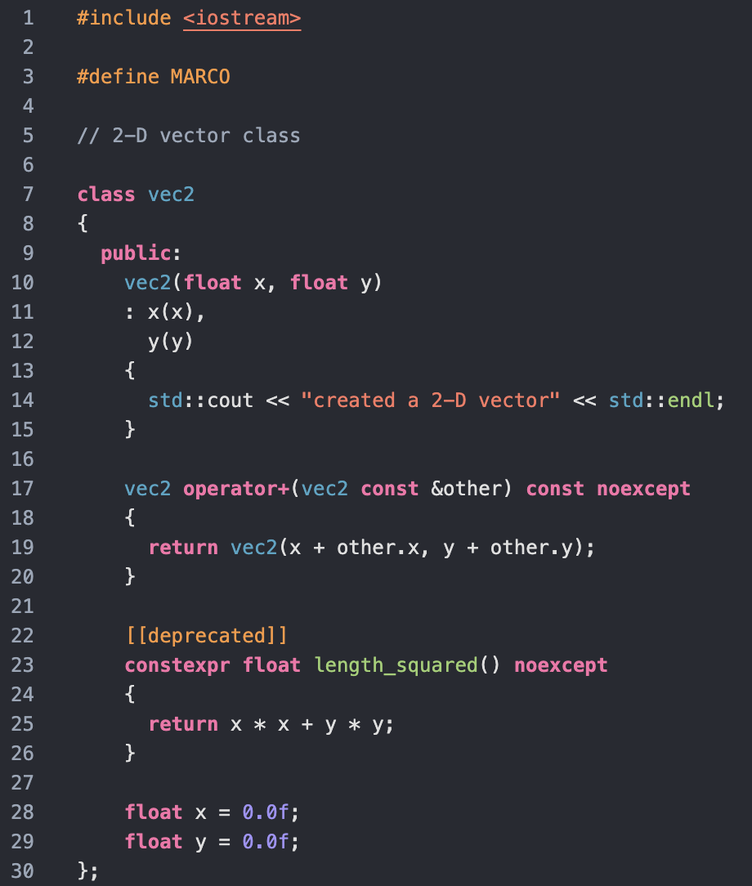
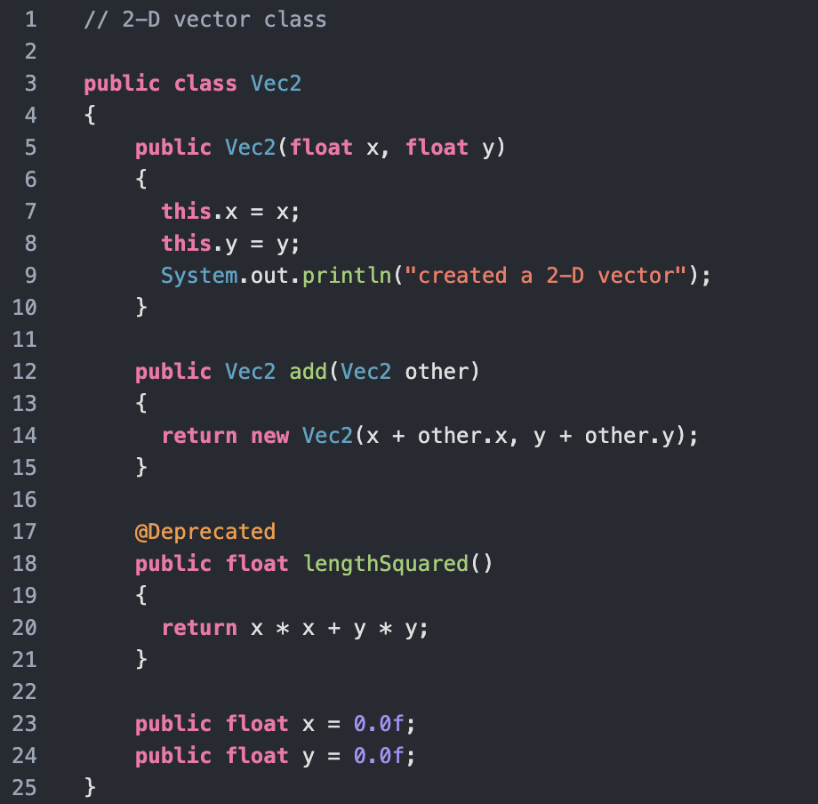

# Simple Theme for C++, Java, and Python 

## C++ Preview

## Java Preview

## Python Preview

### Colours Have Meaning
- `#4eb0cb` Blue: types
- `#a6d67f` Green: functions
- `#a3b0bf` Grey: comments
- `#ffa150` Orange: macros, attributes, decorators, annotations 
- `#fe7bb2` Pink: keywords
- `#a89df7` Purple: numbers
- `#fe8170` Red: strings
- `#e3e3e3` White: variables, punctuation, plain-text